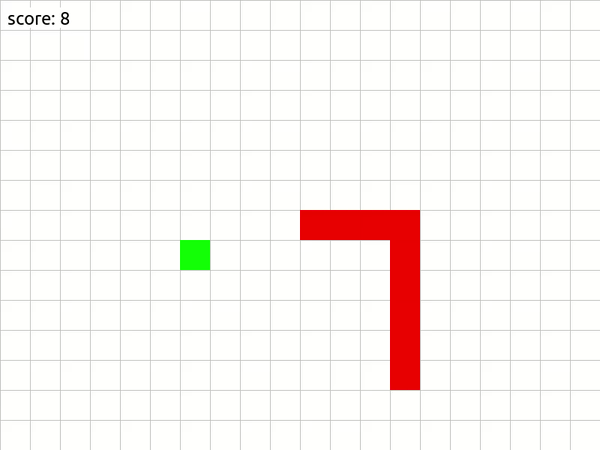

### Customize

In `run.py`:

Change theme (rgb values)
```python
theme = {
    'bg_color': (255, 255, 255),
    'grid_color': (194, 194, 194),
    'food_color': (0, 255, 0),
    'snake_color': (255, 0, 0),
    'font_color': (0, 0, 0)
}
```
Adjust window (width/height) and cube size, optionally disable grid with `grid=False`
```python
UI = UserInterface(
    size=(500, 500),
    **theme,
    cube_size=25
)
```

### Run locally

Clone repo
```
git clone https://github.com/ixtk/snake.git
```

Install requirements (pygame only)
```
pip install -r requirements.txt
```

Run
```
python run.py
```
